# A proposed study: Awareness and perceptions of generative AI usage for supporting learning

Tjun Hoh

*School of Management, UCL*

---

<!-- paginate: true-->

### Generative AI (GenAI) in higher education

* *Assessment*: marking, anti-plagiarism
* *Content creation*: lectures, problem sets
* *Tutoring*: real-time feedback, tailored learning

---

### Generative AI (GenAI) in higher education

* ~~*Assessment*: marking, anti-plagiarism~~
* *Content creation*: lectures, problem sets
* ***Tutoring*: real-time feedback, tailored learning**

---

### Rubber duck debugging
Stuck on a problem? Describe it to a rubber duck!

<!-- _footer: "DALL·E 3 generated image" -->

---

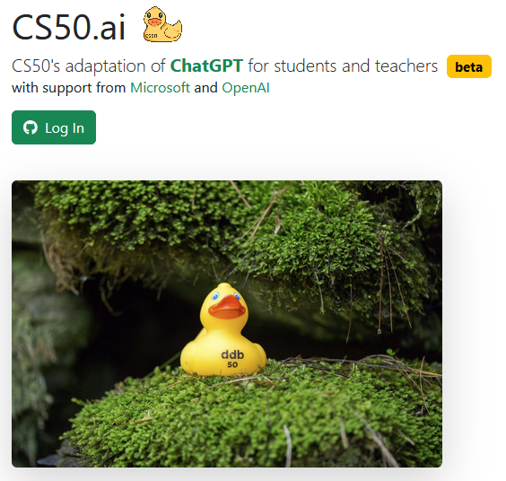

### CS50 duck
Harvard University's AI chatbot for CS50: Introduction to Computer Science

<!-- _footer: "https://cs50.ai/" -->

---

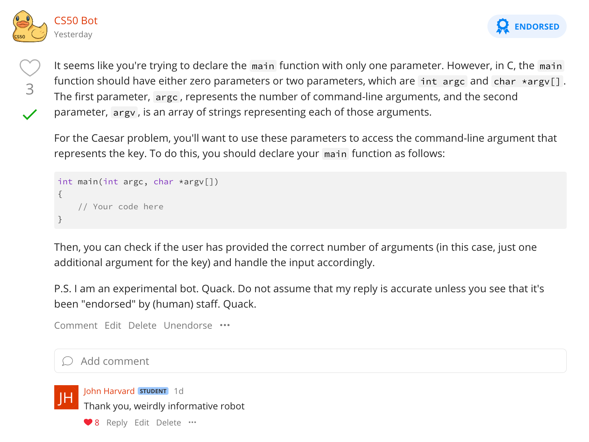

### CS50 duck
* "ChatGPT can be too helpful"
* "The CS50 duck, by contrast, provides helpful hints and guides students to an answer"

<!-- _footer: "https://www.insidehighered.com/news/tech-innovation/artificial-intelligence/2023/06/30/harvard-rolls-out-ai-help-free-tas-time
https://yaledailynews.com/blog/2023/09/07/yale-to-integrate-artificial-intelligence-into-introductory-computer-science-course/" -->

---

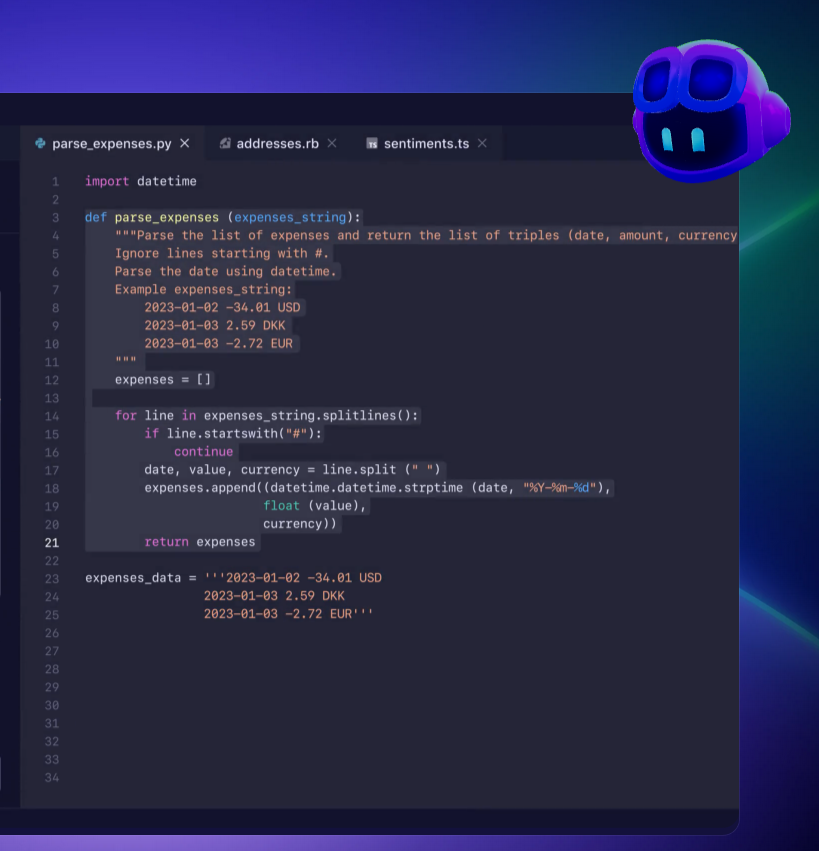

### Copilots / IDE integration

* GitHub Copilot
* Codeium

IDE stands for Integrated Development Environments like VSCode, PyCharm, Sublime Text, etc.

<!-- _footer: "https://github.com/features/copilot" -->

---

### Virtual Learning Environments (VLE) embedding
* University of Westminster
    * "...AI generated quizzes within a module designed to support students to write effective research proposals"
* Northumbria University 
    * "...to generate formative assessment activities, using the in-built AI test generation tools"

<!-- _footer: "https://nationalcentreforai.jiscinvolve.org/wp/2024/04/24/case-study-blackboard-learn-ultras-ai-design-assistant/
https://nationalcentreforai.jiscinvolve.org/wp/2024/06/19/product-notes-blackboard-learn-ultra-ai-design-assistant/" -->

---

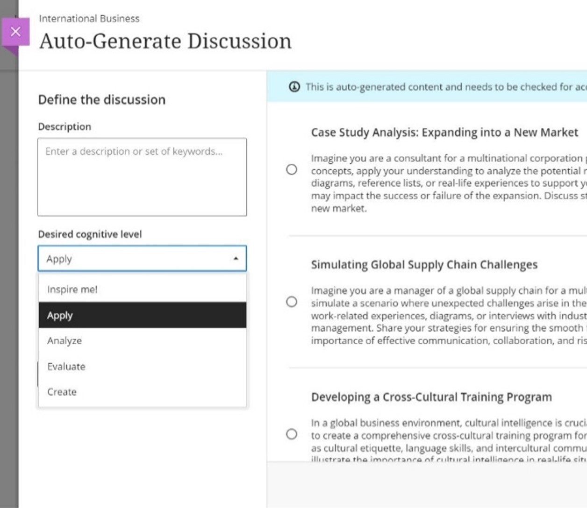

### Blackboard Learn Ultra
Able to generate suggestions based on different cognitive levels from Bloom’s taxonomy

<!-- _footer: "https://www.anthology.com/blog/when-pedagogy-meets-technology-ai-generated-suggestions-for-authentic-assessments" -->

---

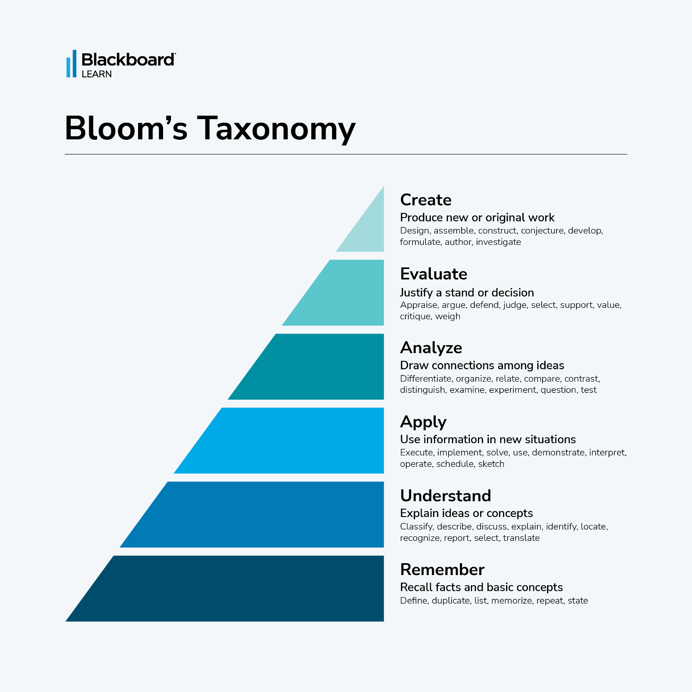

### Bloom's Taxonomy
Hierarchy of cognitive levels for learning

<!-- _footer: "https://www.anthology.com/blog/when-pedagogy-meets-technology-ai-generated-suggestions-for-authentic-assessments" -->

---

### Teaching with AI

* Retrieval-augmented generation
* [Multiple-agent systems](https://papers.ssrn.com/sol3/papers.cfm?abstract_id=4871171)
* [AI-tutor, AI-coach, AI-mentor, AI-teammate, AI-tool, AI-simulator, and AI-student](https://papers.ssrn.com/sol3/papers.cfm?abstract_id=4475995)
* [Simulations, mentoring, coaching, and co-creation](https://papers.ssrn.com/sol3/papers.cfm?abstract_id=4802463)

<!-- _footer: "https://interactive.wharton.upenn.edu/teaching-with-ai/
https://ai-analytics.wharton.upenn.edu/generative-ai-lab/ai-and-education/
https://www.harvard.edu/ai/teaching-resources/" -->

---

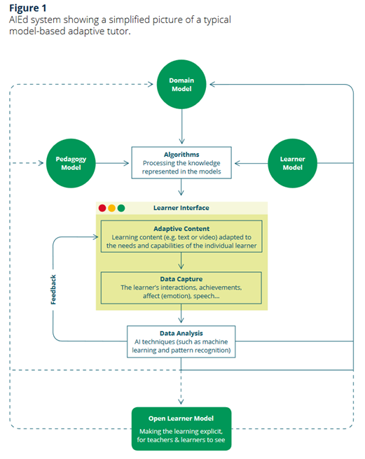

### Retrieval-augmented generation (RAG)

* LEFT: A model-based adaptive tutor

<!-- _footer: "https://discovery.ucl.ac.uk/id/eprint/1475756/" -->

---

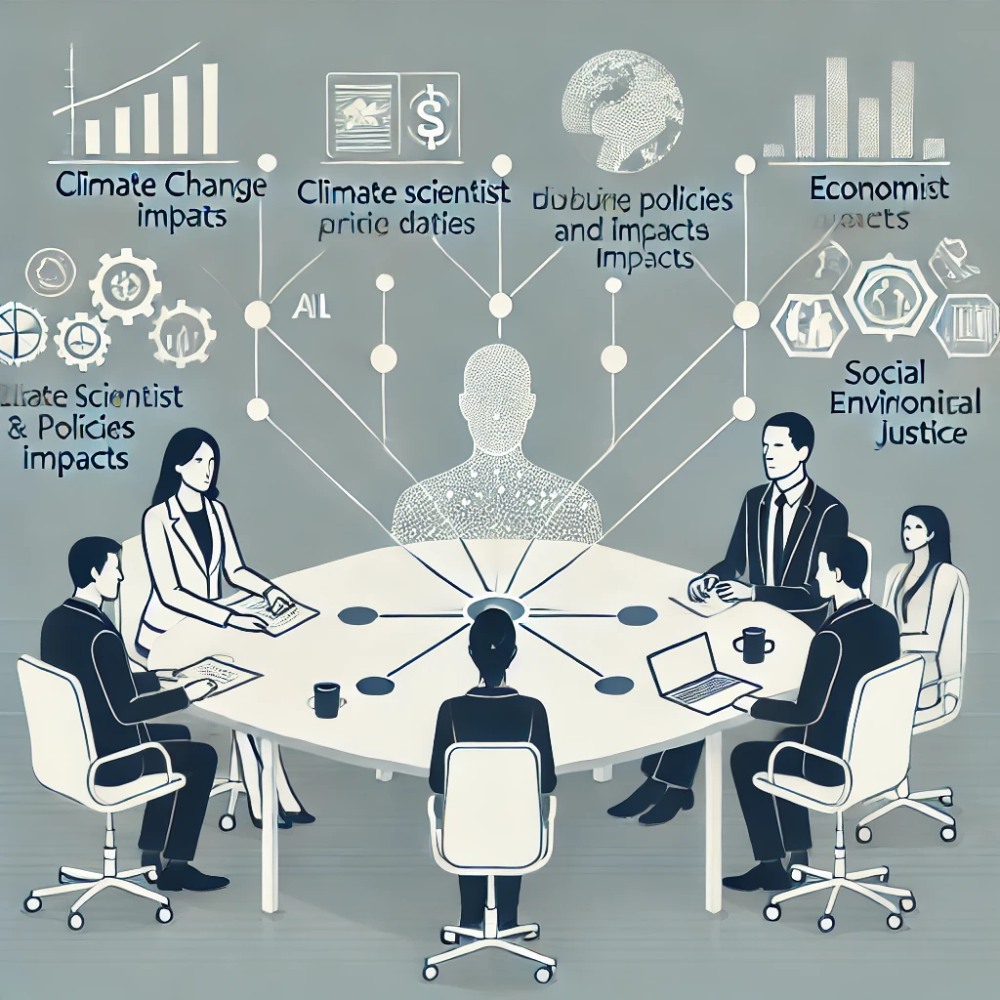

### Multi-Agent Systems

#### Discussing climate change impacts

* Moderator
* Scientist: 
    * scientific data and analysis
* Economist: 
    * economic impacts / policies
* Activist: 
    * perspectives on environmental justice

<!-- _footer: "DALL·E 3 generated image

https://github.com/ncwilson78/System-Prompt-Library/blob/main/Multi-Agent%20Systems/Multi-Agent%20Systems%20Interaction%20Structures.md" -->

---

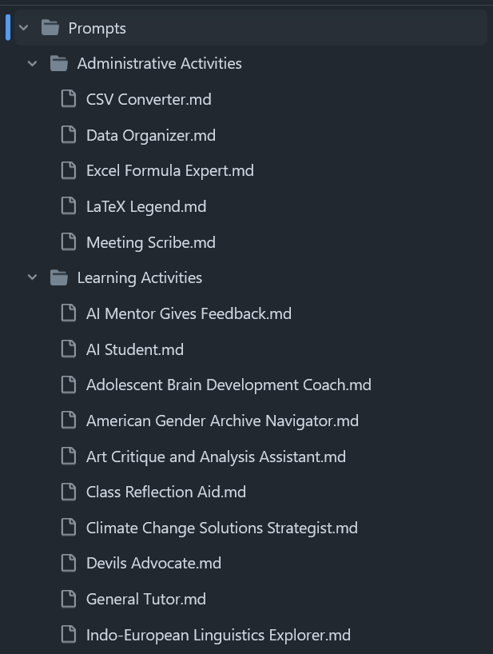
### Prompt library
* ~~Administrative~~
* Learning
* Teaching

<!-- _footer: "https://github.com/ncwilson78/System-Prompt-Library" -->

---

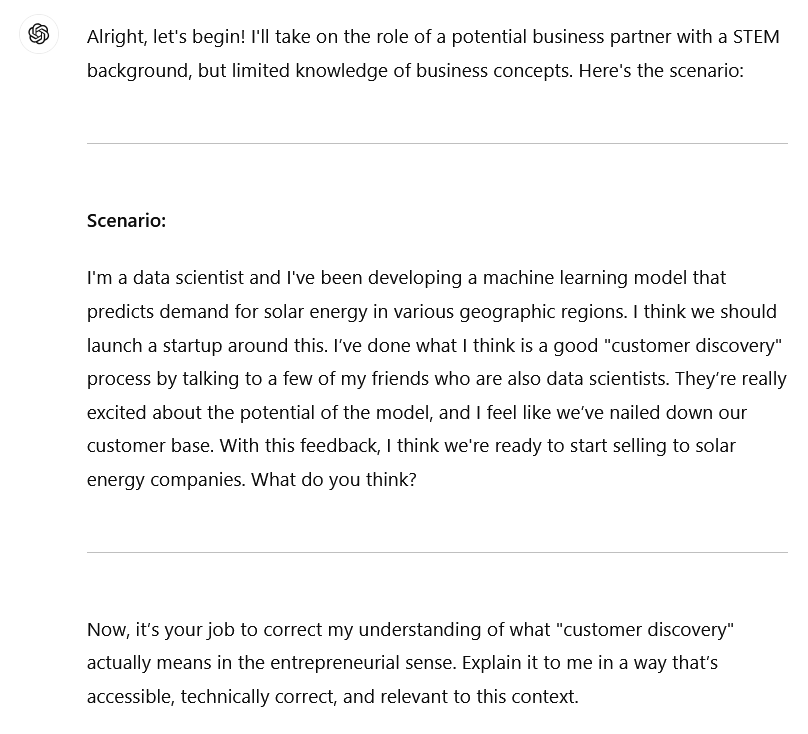

### Creating problem sets
Click here for full conversation: https://chatgpt.com/share/66e99f0e-8474-8002-8c90-fd0b10ec04f3

<!-- _footer: "Prompt based on:
https://www.youtube.com/watch?v=tsmHmjBfGwI" -->

---

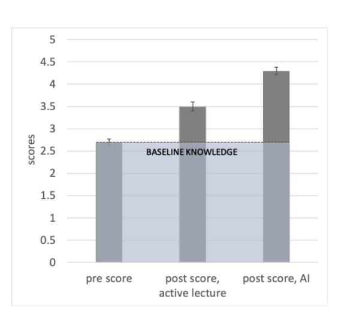

### AI Tutoring Outperforms Active Learning*

*in a Harvard University (USA) undergraduate physics course

* "...learn more than twice as much..."
* "...while spending less time on task"

<!-- _footer: "https://www.researchsquare.com/article/rs-4243877/v1" -->

---

### Challenges: Purpose and role of higher education providers

* Redefining educational roles
* Cultivating critical skills
* Pedagogical reflection

<!-- _footer: "https://www.qaa.ac.uk/docs/qaa/news/quality-compass-navigating-the-complexities-of-the-artificial-intelligence-era-in-higher-education.pdf" -->

---

## Educators' views

[Luleå University of Technology staff survey](https://doi.org/10.48550/arXiv.2404.03486)
* 76.12% of the university teachers surveyed expressed willingness to encourage their students to use generative AI ethically.
* Over 50% currently use generative AI in some form.

[Texas A&M University](https://doi.org/10.48550/arXiv.2304.14415)
* 47% are somewhat to extremely comfortable with students using ChatGPT in courses.
* 64% of faculty and 73% of students have used ChatGPT.

<!-- _footer: "https://doi.org/10.48550/arXiv.2404.03486

https://doi.org/10.48550/arXiv.2304.14415
" -->

---

### Challenges: Enhancing student learning experience

* Balancing technology with human guidance
* Ethical and pedagogical concerns
* Technocratic solutions versus human problems

<!-- _footer: "https://www.qaa.ac.uk/docs/qaa/news/quality-compass-navigating-the-complexities-of-the-artificial-intelligence-era-in-higher-education.pdf" -->

---

## Students' views

[HEPI Policy Note 51](https://www.hepi.ac.uk/wp-content/uploads/2024/01/HEPI-Policy-Note-51.pdf)

* **More than half of students (53%) have used generative AI to help them with assessments.** 
The most common use is as an ‘AI private tutor’ (36%), helping to explain concepts.

* **A ‘digital divide’ in AI use may be emerging.** Nearly three-fifths of students from the most privileged backgrounds (58%) use generative AI for assessments, compared with just half (51%) from the least privileged backgrounds. 

* **Only a fifth of students (22%) are satisfied with the support they have received on AI.** Most students (62%) are neutral or say they do not know.

<!-- _footer: "https://www.hepi.ac.uk/wp-content/uploads/2024/01/HEPI-Policy-Note-51.pdf" -->

---

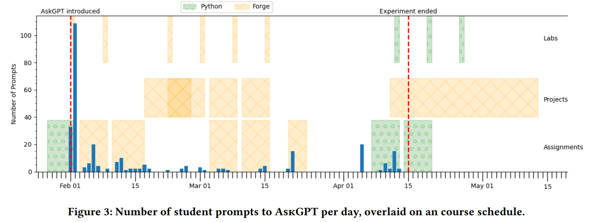

## Student use of GenAI declining over time?!*
*in a Brown University (USA) undergraduate course on applied logic and formal methods

<!-- _footer: "https://dl.acm.org/doi/10.1145/3576882.3617921" -->

---

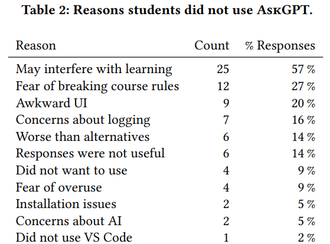

## Student responses

* **P2:** "I learn better through struggling to find an answer. If it comes too easy, it’s hard for me to remember any information I’ve learned."

* **P11:** "I have a vitriolic hatred toward AI."

<!-- _footer: "https://dl.acm.org/doi/10.1145/3576882.3617921" -->

---

## Purpose of study

* To inform generative AI-based pedagogical developments
    - University policy
    - Staff guidance and training
    - Integration into teaching and learning

---

## Survey questions: perceptions and awareness

* Do you **trust** answers from GenAI?
* Are you **encouraged** to use GenAI?
* Has using GenAI made you more **confident** in learning?
* How **anxious** do you feel when:
    * asking lecturers or colleagues for help?
    * using GenAI (for assignments)

---

## Survey questions: feeding forward

* Do you need **training** in using GenAI:
    * from lecturers or support centres?
    * to avoid plagiarism?
    * craft good prompts?
* Would you **use** GenAI for:
    * analysing data?
    * as a tutor?

---

## Research themes

* Awareness and understanding
    - Common tools: ChatGPT, Microsoft Copilot
    - Embedded technology: Microsoft Word, Grammarly
* Usage patterns
    - Implicit versus explicit usage expectations

---

## Research themes

* Trust and confidence
    - Ethical concerns
    - Domain expert knowledge
* Perceptions and anxiety
    - Breach of privacy
    - Confidence to ask questions
* Digital divide and equity of access
    - Accessibility and cost

---

## Research themes

* Guidance
    - Supplementing university instructors and tutors
* Learning and teaching strategies
    - Fostering generative AI culture

---

## Logistics

* Multi-stage survey targetting students and educators
    - Current focus: statistics and data science
    - Future focus: business, management, entrepreneurship

---

## Participants

*Currently focussing on students from:*

#### UK
University College London
Coventry University

#### Australia 
La Trobe University
Federation University
Macquarie University

---

## Appendices: some literature

* [Generation gap](https://doi.org/10.1186/s40561-023-00269-3)
* [Artificial intelligence anxiety scale](https://doi.org/10.1080/10494820.2019.1674887)
* [Intelligent tutoring systems](https://doi.org/10.1109/TE.2023.3331055)
* [Technology Acceptance Model](https://doi.org/10.2307/249008) links to an [user acceptance perspective](https://doi.org/10.1016/j.caeai.2024.100203):
    - perceived usefulness
    - perceived ease of use

---

## The end 🤔